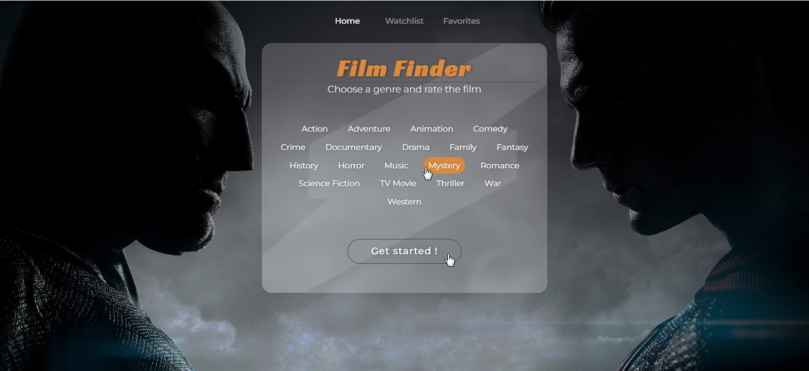
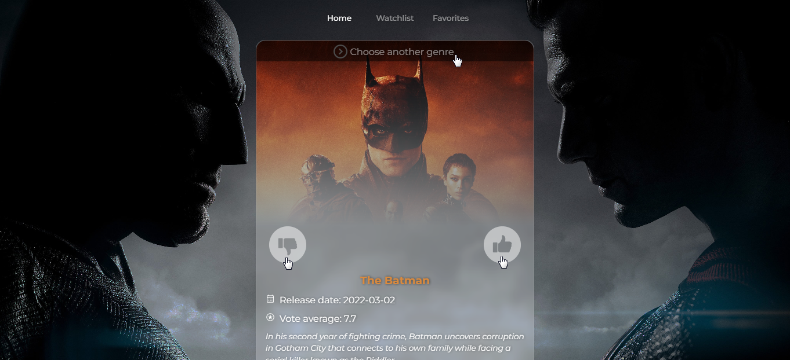
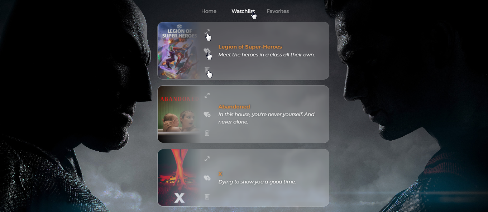
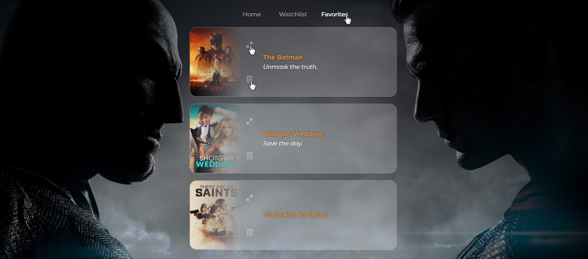

# Awesome Film Finder App

Introducing a new movie rating app! With this simple user-friendly app, you can rate random movies from chosen genre and add them to your watchlist for future reference. All movie related data provided with [The Movie Database (TMDB)](https://www.themoviedb.org/).  Discover new movies you might enjoy, and keep track of the ones you want to watch again and again with the convenient favorites list.
Whether you're a movie buff or just looking for something to watch on a lazy Sunday afternoon, this app is the perfect way to discover new movies and keep track of your favorites. 

## How it looks

- Choose the genre you want and press the button "Get started!"
- 
-  Like or disslike random movie. Liked movies goes to watchlist.
- 
- Watchlist contains your liked movies where you can read comprehensive information about film, add it to favorites or remove using buttons located on movie card.
- 
- Favorites is similar to the watchlist with it's functionality
- 

##  Links
Try it now! [Awesome Film Finder ](https://vvv-sss.github.io/film_finder/)

##  Built with

- React JS (React Router v6.4, Framer Motion)
- Javascript, AJAX
- HTML5
- SCSS

##  Author

- Volodymyr Serbulenko
- E-mail: serbulenko1volodymyr@gmail.com